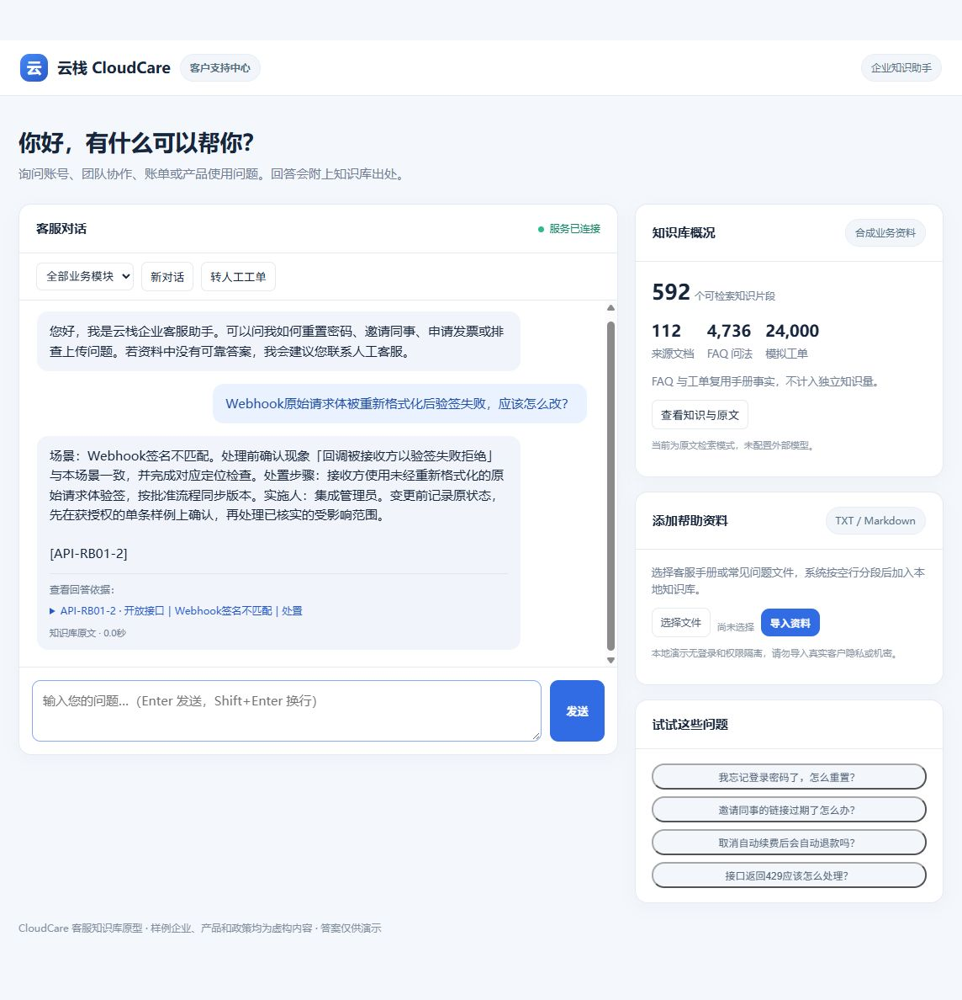

# CloudCare · 企业客服知识库 RAG

面向企业服务场景的中文客服项目：账号与权限、订单与售后、账单订阅、知识中心、工单和开放接口等16个模块。支持带出处问答、知识浏览、TXT/Markdown 导入、业务模块筛选，以及本地人工跟进工单。

仓库：<https://github.com/Mysarff/service>。这是一个独立的新项目；原教育项目不需要迁移或修改。



## 现在能做什么

- 无额外依赖启动本地网页，加载592个知识片段；没配模型也能展示检索到的原文。
- 配置兼容 Chat Completions 的模型接口后，用召回资料生成回答并校验引用编号；调用失败会明确展示原文回退状态。
- 浏览回答引用和对应手册；对实时订单、未知价格或证书等资料无法支持的问题提示人工核实。
- 导入TXT/Markdown并分段，自动避免相同内容重复导入；模拟提交人工工单。

**产品、规则、资料和历史工单均为合成演示数据。人工工单只保存在本地，未接入真人客服。这个版本不是生产级客服平台。**

## 启动

Python 3.10+，仅使用标准库，无需安装数据库、模型权重或第三方包：

```bash
git clone https://github.com/Mysarff/service.git
cd service
python app.py
```

打开 <http://127.0.0.1:8088/>。Windows也可以运行 `start.ps1`。

若要启用模型生成，将 `config.example.ini` 复制为 `config.ini` 并填写模型名、服务地址和自己的密钥，然后：

```bash
python app.py --model-config config.ini
```

也支持环境变量 `OPENAI_BASE_URL`、`OPENAI_API_KEY`、`OPENAI_MODEL`，优先于INI。密钥和运行配置受 `.gitignore` 排除，切勿放入手册或源码。使用外部模型时，问题、最近对话和召回片段会发送到指定服务。`model_enabled=true`仅表示配置齐全，实际调用是否成功以每条回答的模式为准。

## 数据规模与来源

| 数据 | 数量 | 用途 |
|---|---:|---|
| 模块操作手册 | 16份 | 可阅读的来源文档 |
| 故障处置手册 | 96份 | 16模块各6个场景，共112份来源文档 |
| 知识片段 | 592个 | 192个模块章节 + 16个专项规则 + 384个场景片段 |
| FAQ问法 | 4,736条 | 每个片段8种模板表达，供接口演示和覆盖检查 |
| 模拟客服工单 | 24,000条 | 固定种子采样FAQ，供会话流程与导入演示 |
| 开发测试问题 | 88道 | 64道有来源问题 + 24道无依据/越界问题，不进入索引 |

知识来自 `scripts/build_data.py` 中的模块规则，以及 `scripts/scenarios.py` 中明确编写的96个故障场景。场景各分为定位、处置、验收、升级4段。每条片段含 `id`、`parent_id`、`category`、`source`、`version` 和 `synthetic`。正文共70,258字符，完整重复为0，但仍有168对词面高度相似的模板片段。**592是切分单元数，未证明为592个独立事实；FAQ与工单不能加算为知识。**

```bash
python scripts/build_data.py
python scripts/check_data.py
```

`data/manifest.json`记录数量、版本、随机种子和SHA-256。生成器也允许 `--tickets 800000` 创建80万条**模拟会话记录**，用于单独规划数据量实验；这不会增加业务事实数量，也没有在本次进行80万规模检索或性能验证。该命令会重新生成派生数据，运行后需要重启服务刷新索引。

数据构建及扩展方法见 [DATASET.md](docs/DATASET.md)。

GitHub中FAQ和模拟工单以 `.jsonl.gz` 完整压缩保存，核心 `knowledge.jsonl` 保持明文，不影响直接启动。运行数据生成命令可以恢复明文表；完整性检查能直接检查压缩文件解压后的内容哈希。

## 检索与问答流程

```text
模块规则与场景 → Markdown手册 → 带来源章节 → 内存倒排索引
问题 → 能力边界规则 → 模块筛选 → BM25召回 + 标题/模块加权 + 场景分组与子段扩展
     → 证据门槛 → Top-3资料 + 最近对话 → 可选模型生成 → 引用ID检查
     → 无模型/调用失败：原文回退；无依据：说明限制并转人工
```

常驻索引缓存词项权重；倒排表缩小候选集合；同一场景分组防止相邻章节挤占结果，并按问题阶段取同源子段。新增资料后重建索引。当前实现是词项检索，**未实现神经向量、Milvus、BGE重排、BERT分类或HyDE**。这是轻量场景父子关联，未复现教育版全部父块扩展策略。组件对照见 [ARCHITECTURE.md](docs/ARCHITECTURE.md)。

## 验证结果

运行：

```bash
python scripts/check_data.py
python evaluation/run_checks.py
python evaluation/benchmark.py --requests 2000 --rounds 10
python evaluation/evaluate.py
python scripts/render_report.py
```

15项接口与核心行为检查通过，包括来源、拒答、去重、长文本尾部保留、索引刷新、短追问、两种检索路径一致性及模型异常回退。

| 同一语料与分词下的检索对照 | Top-1 | Hit@5 |
|---|---:|---:|
| TF-IDF稀疏余弦排序 | 44/64 | 60/64 |
| BM25，无查询模块加权 | 46/64 | 61/64 |
| 增强BM25，含场景分组与扩展 | 57/64（89.06%） | 64/64 |

24道负例经规则修复后均走限制说明。倒排候选与全量扫描640次排名及分数完全一致，本机平均检索耗时从1.475 ms降至1.074 ms（下降27.2%）。6,000次本机原文检索HTTP请求成功；8并发P95为21.580 ms，最大1,029.085 ms。每组仅数秒，**不是外部模型延迟、持续压测或生产SLA**。

**题目参与过调试，属于开发回归，不能当作独立测试集或真实客服准确率。**首次失败、7道剩余Top-1失败及逐请求计时均保留。当前真实模型仍缺有效配置完成验收。完整口径与证据见 [评测报告](docs/BENCHMARK.md)，可用简历措辞见 [RESUME.md](docs/RESUME.md)。

端到端情况见 [VALIDATION.md](docs/VALIDATION.md)；验证模型调用可运行 `python evaluation/live_smoke.py`（会使用运行中服务的模型配置，可能产生调用费用）。

## 文件导航

| 目录/文件 | 内容 |
|---|---|
| `app.py` / `engine.py` | HTTP接口、检索、模型调用、引用校验、资料导入 |
| `static/index.html` | 客服聊天、知识浏览、上传与工单页面 |
| `data/manuals/` / `data/runbooks/` | 16份模块手册 + 96份故障处置手册 |
| `data/knowledge.jsonl` | 592个检索片段 |
| `data/faq.jsonl.gz` / `data/simulated_tickets.jsonl.gz` | 完整压缩的问法与模拟对话 |
| `scripts/` | 数据构建与完整性检查 |
| `evaluation/` / `tests/` | 测试题、对照结果和接口检查 |
| `runtime/` / `data/uploads/` | 本地运行记录和用户上传，均不提交 |

## 使用边界

默认仅监听本机。尚无登录、真正的多租户权限过滤、业务数据库连接、审计后台、队列或生产级并发控制；模块筛选不是安全权限隔离。上传只支持TXT/Markdown，样例手册中提及的其他业务功能并不代表本项目实现了它们。规则拒答和引用ID校验都不能保证语义完全正确，尤其在检索到相关但不能回答的资料时。真实落地要补真实文档审核、访问控制、独立评测和资源压力测试。

代码和本项目生成的合成资料采用MIT许可证。第三方模型服务需遵循其自身条款。
