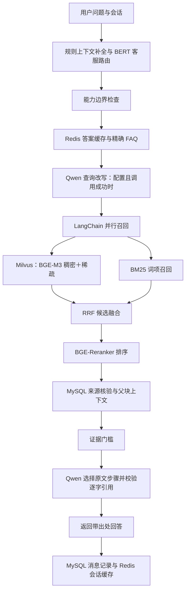

# CloudCare 企业客服 RAG 全栈版本

客服项目使用独立包 `cloudcare/`，把教育项目已有的多格式文档、BERT 路由、BGE 检索、模型重排和数据库链路迁移为客服业务实现。教育项目的数据库、向量集合、源码和模型训练输出不参与本项目写入。

## 技术组件与实际用途

| 组件 | 客服项目中的用途 | 代码 |
|---|---|---|
| Python / FastAPI / Uvicorn | 本机网页、严格请求校验、线程池执行阻塞推理和数据库操作 | `app.py`、`cloudcare/api.py` |
| LangChain | Document 数据结构、递归父子分块、并行检索 RunnableParallel、提示词与模型调用链 | `cloudcare/documents.py`、`pipeline.py`、`llm.py` |
| BERT | 独立客服标签：知识咨询、人工跟进、服务范围外；使用客服合成样本训练分类头 | `cloudcare/neural.py`、`scripts/train_support_router.py` |
| BGE-M3 | 本地生成 1024 维稠密向量和学习得到的稀疏词项权重 | `cloudcare/neural.py` |
| Milvus | 保存真实稠密／稀疏向量，分别召回后进行 WeightedRanker 融合 | `cloudcare/retrieval.py` |
| BM25 | 与神经检索并行的词项召回；候选以 RRF 融合 | `cloudcare/pipeline.py` |
| BGE-Reranker | 对 Query 与候选片段进行真实 CrossEncoder 推理、再次排序 | `cloudcare/neural.py` |
| MySQL / SQLAlchemy / PyMySQL | 连接池、短事务，持久化文档、父块、子块、FAQ、消息和演示工单 | `cloudcare/storage.py` |
| Redis | 实际答案缓存、会话缓存、FAQ 规范化精确匹配与词项倒排索引 | `cloudcare/storage.py` |
| RapidOCR / ONNX Runtime | 图片与扫描 PDF OCR；Word、PPTX 的图片文字识别 | `cloudcare/documents.py` |
| Qwen API | 使用兼容 DashScope 的接口改写查询、从检索证据选取回答步骤；需有效用户密钥 | `cloudcare/llm.py` |

安装包、存在模型文件、配置了服务地址、真实推理成功、真实入库成功、真实生成通过校验是不同状态。`scripts/doctor.py`、`/api/health`、每条回答的 `trace` 分别记录这些状态。数据库不可用时不会使用内存字典或 SQLite 冒充成功；神经模型缺失时也不会用规则打分冒充 BGE 或 BERT。

## 完整处理流程



精确 FAQ、规则拒答、寒暄或人工请求可能提前返回。外部模型未配置、超时、调用失败或生成引用不合格时，界面明确显示资料原文或模型回退状态。引用校验不等于业务事实审核；本项目资料为合成演示内容。

## 知识单元和数据条数

保留的样例语料覆盖 **16 类业务知识主题**，包括账号、组织、工单、订单、售后、账单订阅及开放接口等。它们是资料分类，不意味着实现了对应企业业务系统。

| 数据 | 样例数量 | 是否增加知识单元 |
|---|---:|---|
| 模块手册 | 16 份 | 文档按章节形成片段 |
| 故障处置手册 | 96 份 | 每个故障场景含定位、处置、验收、升级阶段 |
| 来源文档合计 | 112 份 | 文档数与片段数分开统计 |
| 检索子片段 | **592 条** | **按一条可追溯索引记录计一个知识单元** |
| FAQ 问法 | 4,736 条 | 复用知识片段，不能相加为新知识 |
| 模拟会话工单 | 24,000 条 | 合成演示记录，不进入知识检索索引 |

每条知识单元保留来源、业务分类、版本、父块、内容哈希、合成标记等。Milvus 在**同一条记录**中保存 `dense_vector` 和 `sparse_vector` 两个字段，所以 592 条记录仍是 592 个知识单元，不能写成 1,184 个独立知识。592 也不是经过人工核实的独立事实数。

实际入库后，MySQL `knowledge_chunks` 和 Milvus 的实际行数需要核对。`scripts/initialize.py` 保存提交数量、服务器查询数量及向量抽样到 `evaluation/fullstack_index.json`；有用户上传时，总数可以大于样例数。网页“知识库概况”显示实时资料数量，不能用它证明答案准确率或大规模吞吐能力。

## 存储隔离

| 服务 | 默认位置 | CloudCare 命名空间 |
|---|---|---|
| MySQL | `127.0.0.1:3308` | 数据库 `cloudcare_support` |
| Redis | `127.0.0.1:6381/0` | 键前缀 `cloudcare:v2:` |
| Milvus | `127.0.0.1:19531` | 集合 `cloudcare_support_v2` |

MySQL 表为 `documents`、`knowledge_parents`、`knowledge_chunks`、`faq`、`sessions`、`messages`、`tickets`。初始化只创建缺失表和更新本项目记录，不执行 DROP。Redis 不执行 FLUSHDB。Milvus 创建或复用独立集合，不删除教育集合。

每次向量查询携带 `tenant_id`、`visibility` 和可选业务分类过滤，MySQL 取回后再次核对来源范围与内容哈希。当前网页固定使用演示租户 `demo` 的公开资料，未提供企业账号登录、租户身份认证或完整权限管理。

## 文档处理与上传

支持 TXT、Markdown、PDF、DOCX、PPTX、PNG、JPEG、WebP，默认上限 10 MB。旧二进制 DOC/PPT 需要先转换成 DOCX/PPTX。文件头和 Office 包内部结构必须匹配扩展名；文本需 UTF-8，拒绝明显二进制伪装。

PDF 先提取文本，对缺少文本的扫描页渲染后运行 RapidOCR；Word 保留段落与表格并识别嵌入图片；PPTX 按页提取文本、表格和图片文字。解析限制覆盖压缩展开大小、页面数、OCR 图片数和像素数。

新上传文档使用 LangChain `RecursiveCharacterTextSplitter`，默认父块 1,200 字、子块 300 字、重叠 50 字。子块保存父块内容、页码、偏移、来源及 SHA-256。文件内容哈希用于重复导入判断，片段内容哈希用于 MySQL 与 Milvus 一致性核对。

样例 592 条是已有章节／场景片段，初始化保留其 ID 以便与历史评测题对应；不能声称全部样例均由此次默认 300 字自动切分重新生成。

## 安装与程序入口

在客服项目目录操作。Windows 可运行：

```powershell
powershell -ExecutionPolicy Bypass -File scripts/bootstrap.ps1 -CreateEnv -CreateVenv -InstallDependencies -StartServices -SkipDoctor
```

该脚本创建客服项目自己的 `.venv` 和忽略提交的 `.env`，安装 `requirements-full.txt`，启动 `compose.yaml` 中的独立服务。Docker Engine 必须可用。密码保存在本地配置；重跑时保留已有值，不把教育项目密码或密钥复制进源码。

随后在该虚拟环境执行：

```powershell
.venv\Scripts\python.exe scripts/train_support_router.py --device auto
.venv\Scripts\python.exe scripts/initialize.py
.venv\Scripts\python.exe scripts/doctor.py --probe-models --probe-ocr --probe-llm --output evaluation/fullstack_doctor.json
.venv\Scripts\python.exe app.py
```

打开 `http://127.0.0.1:8088/`。`start.ps1` 也启动客服服务。BGE-M3、重排器和 BERT 在本地推理，默认有可用 CUDA 时使用 GPU，否则使用 CPU；模型权重不提交 Git。已有教育模型目录只作为只读基础权重，客服训练输出写入本项目 `runtime/models/support-router/`。安装 CUDA 12.6 版可给安装脚本增加 `-TorchRuntime cu126`，镜像构建与首次启动见 [DEPLOYMENT.md](DEPLOYMENT.md)。

默认 `sequential` 内存策略依次加载、释放 BERT／编码器／重排器，同一服务实例的上传与问答共用推理锁，避免大模型同时占用本机显存及系统内存。查询向量缓存继续保留。实际请求耗时包含模型重载，资源充足时可设 `CLOUDCARE_MODEL_MEMORY_POLICY=resident` 后重新测量。

外部 Qwen 配置使用 `CLOUDCARE_QWEN_API_KEY`、`CLOUDCARE_QWEN_BASE_URL`、`CLOUDCARE_QWEN_MODEL`，或者客服项目自己的 INI。输入问题、近期对话和检索证据会发送到配置的模型服务。`doctor.py --probe-llm` 会进行一次真实 API 调用，可能产生费用。`app.py --offline` 停用外部调用，但仍要求本地数据库、索引及神经模型可用。

接口包括 `GET /api/health`、`GET /api/knowledge`、`POST /api/chat`、`POST /api/upload`（TXT/MD JSON）、`POST /api/upload-file`（多格式 multipart）及 `POST /api/tickets`。所有路线先验证本机 Host 与 Origin，上传及历史对话有明确长度限制；工单仅写本项目 MySQL，未连接真人客服或执行退款。

## 验证与简历指标

```powershell
.venv\Scripts\python.exe -m unittest discover -s tests -p test_documents_fullstack.py -v
.venv\Scripts\python.exe -m unittest discover -s tests -p test_api_fullstack.py -v
$env:CLOUDCARE_INTEGRATION='1'
.venv\Scripts\python.exe -m unittest discover -s tests -p test_storage_fullstack.py -v
```

文档检查真实运行 OCR、Office 和 PDF 解析；API 检查只验证传输、输入及边界，不替代模型与数据库验收。存储集成检查要求真实 CloudCare MySQL/Redis，测试写入独立随机 ID 并清理自身记录，不读取或删除教育记录。前端自动测试需要 Node.js 18+ 的 `fetch`。

历史 BM25 服务保存在 `baseline_app.py`，历史检索器保存在 `engine.py`。`evaluation/benchmark.py` 和旧接口测试使用这个基线，便于回归旧方案。历史 Top-1、毫秒级 BM25 耗时和原文 HTTP P95 **不能当成当前 BGE＋Milvus＋重排＋Qwen 全流程性能**。

新全栈成果只能引用当前版本保存的真实服务检查、入库审计、BERT 分类报告及全栈检索／生成报告。合成分组测试、开发回归题、真实客户盲测有不同含义；未跑完的指标需要写成未验收，不能用配置或代码存在代替运行证据。
